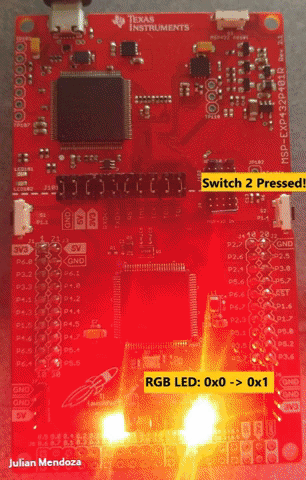

# IntroToRealTimeSystems

A collection of projects studying real-time systems.

## Managing Interrupts

In this demo, we have two inputs and two outputs. 
* Switch one toggles between LEDS (default: red). 
* Switch two toggles between LED states (on/off or toggling through all RGB states).
